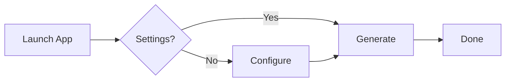

# ZeduloPayslips: UI Guide

> 💡 **Backend-focused? Skip to [Workflow Summary](#workflow-summary).**  
> This guide explains the interface without frontend fluff.

---

## 🖥️ Main Window Overview

```
┌─────────────────────────────────────┐
│ Welcome [Username],                 │
│ [Instruction subtitle]              │
│                                     │
│ ┌─ Select Month(s) ───────────────┐ │
│ │ ☐ Jan ☐ Feb ☐ Mar...          │ │
│ │ [Select All] [Clear All]        │ │
│ └─────────────────────────────────┘ │
│                                     │
│ [Generate] [Settings] [Send All]    │
│ Progress: _                         │
│                                     │
│ ┌─ Generated Payslips (scrollable)│ │
│ │ • Name (Month)                  │ │
│ │   filename.pdf                  │ │
│ │   [Review] [Folder] [Email]     │ │
│ └─────────────────────────────────┘ │
└─────────────────────────────────────┘
```

---

## ⚙️ Settings Configuration (One-Time Setup)

Click **Settings** → Fill these fields:

| Field | What It Is | Example Value |
|-------|-----------|---------------|
| `Employee Spreadsheet` | Excel file with employee data | `~/Payroll/employees.xlsx` |
| `Payslip Template` | Excel template with placeholder cells | `~/Templates/payslip.xlsx` |
| `Output Folder` | Where PDFs will be saved | `~/Payslips/2024/` |
| `Employee Name Header` | Column name for employee name in spreadsheet | `"Full Name"` |
| `Email Header` | Column name for email address | `"Work Email"` |
| `Basic Salary Cell` | Template cell reference for gross salary | `B5` |
| `Tax Cell` | Template cell for calculated tax | `B10` |
| `SSF Cell` | Template cell for social security contribution | `B11` |
| `Net Pay Cell` | Template cell for final net pay | `B12` |

✅ Click **Save** → Settings window auto-closes.
❌ Invalid paths? You'll get an error on on save.

---

## 🔄 Workflow Summary (Backend Dev Cheat Sheet)



### Key Behaviors (No Surprises)
| Action | Backend Effect |
|--------|---------------|
| **Generate Payslips** | Threads worker → reads Excel → fills template → exports PDF via LibreOffice |
| **Review PDF** | `xdg-open` on generated file (non-blocking) |
| **Open Folder** | `xdg-open` on parent directory |
| **Send Email** | Calls `send_payslip_email()` → Thunderbird `mailto:` URI (no SMTP in app) |
| **Send All Emails** | Threads loop over valid emails → opens Thunderbird compose windows sequentially |
| **Cancel Mailing** | Sets `threading.Event` → worker exits after current email finishes |

---

## 🐛 Troubleshooting (UI Layer)

| Symptom | Likely Cause | Backend-Friendly Fix |
|---------|-------------|---------------------|
| Settings won't save | Path doesn't exist or no read permission | `ls ~/path/to/file.xlsx` → fix path/permissions |
| "No Email" on button | Spreadsheet missing email column or header mismatch | Check `Email Header` config vs actual column name |
| PDF not generated | LibreOffice CLI not found | `which soffice` → if missing: `sudo apt install libreoffice` |
| Thunderbird doesn't open | Not installed or not default mail handler | `sudo apt install thunderbird` + `xdg-settings set default-web-handler mailto thunderbird` |
| UI freezes during generation | Large dataset + slow disk I/O | Normal—generation is threaded; if truly stuck, check `htop` for LibreOffice zombie processes |
| "Stopping..." button stuck | Worker thread didn't reach `finally` block | Rare—restart app; if reproducible, check `~/.zedulopayslips/app.log` (add logging if needed) |

---

## 💡 Pro Tips (For Efficiency)

- **Re-generate safely**: Same month/employee = overwrite PDF. No manual cleanup needed.
- **Batch email is manual-send by design**: Thunderbird windows open, but *you* click Send. Keeps credentials out of the app.
- **Output folder structure**: App auto-creates `YYYY/MM/` subfolders inside your output path.
- **Cancel anytime**: Click **Cancel Mailing** during batch send → stops after current email.
- **Linux-native**: Uses `xdg-open`, `subprocess`, and standard paths—no GUI framework magic.

---

## 🧩 Integration Notes (For Developers)

- **Threading model**: All long ops (`generate`, `send_bulk`) run in `daemon=True` threads. UI updates via `root.after(0, ...)`.
- **Config storage**: `~/.zedulopayslips/config.json` (loaded once at startup, re-saved on Settings save).
- **Error handling**: Worker threads catch exceptions → marshal to main thread via `after()` → show `messagebox`.
- **No frontend state management**: UI is imperative Tkinter; state lives in `App` instance attributes.

> 🛠️ **Want to extend?**  
> - Add new export format: modify `PayslipGenerator.generate_payslips()`  
> - Support another mail client: update `send_payslip_email()` in `src/services/mailing.py`  
> - Add keyboard shortcuts: bind `<Control-g>` to `self._start_generation` in `_build_ui()`

---

## 📸 Screenshots (Optional Placeholders)

*(TODO: Add later)*

```
[TODO: main_window.png]
[TODO: settings_window.png]
[TODO: generated_list.png]
```

---

*Last updated: March 2026 | For backend/architecture questions, see `src/` code or contact Joel.*

